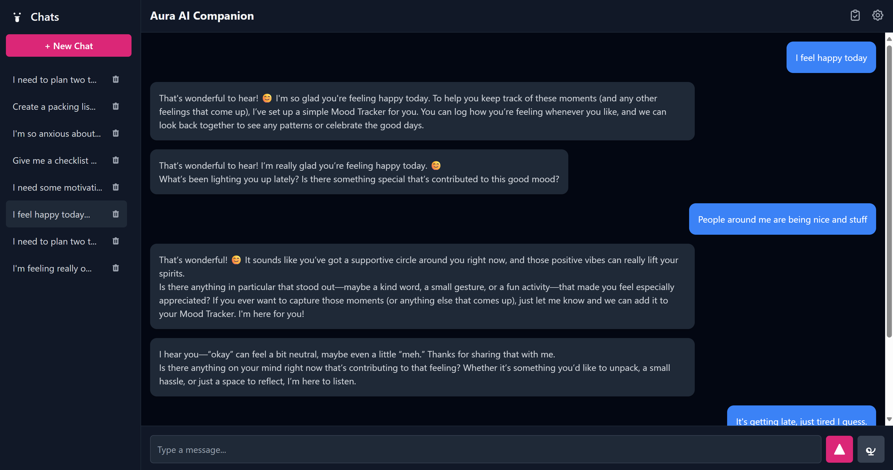

Aura AI Companion
Aura is a locally-run, privacy-focused AI companion designed to be a supportive partner for mental wellness and personal productivity. Built with a focus on proactive assistance, Aura doesn't just answer questions—it anticipates your needs and provides interactive tools to help you organize your thoughts, manage stress, and stay motivated.

This project runs entirely on your local machine using Ollama, ensuring your conversations are always private.

What's Inside?
Aura is more than just a chatbot. It's an "agentic" AI that uses a set of built-in tools to actively help you.

Proactive Toolbox: As you chat with Aura about your day, it will automatically create and save helpful tools to your personal "Toolbox."

Interactive Tools:

Checklists: Perfect for planning a project, organizing your day, or breaking down a big goal into small, manageable steps.

Mood Tracker: A simple, persistent tool to log your emotional state over time, helping you recognize patterns.

Breathing Exercises: A guided pacer to help you calm down during moments of stress or anxiety.

Affirmation Cards: Get a boost of motivation or confidence when you're feeling unsure.

Privacy First: Your conversations and data are stored locally in your browser. Nothing is sent to the cloud.

Customizable: You can tweak Aura's personality, voice, and even the underlying AI model through the settings panel.

How It Works
The magic of Aura is in its architecture. Instead of just generating text, the AI's "brain" is instructed to embed hidden command tags in its responses.

You send a message, like "I'm feeling really overwhelmed today."

The local AI model processes this and decides a breathing exercise would be helpful.

In its friendly, conversational response, it secretly includes a tag like <tool_create type="breathing_exercise" />.

The application front-end sees this tag, creates the interactive breathing exercise tool in the background, and saves it to your Toolbox.

The tag is removed from the message, so all you see is Aura's natural, helpful reply.

This "function calling" style of architecture makes the tool creation process robust and reliable.

Getting Started
To get Aura running on your own machine, you'll need to have Ollama installed and running.

1. Ollama Setup
First, make sure Ollama is running. Then, pull the models that Aura uses. Open your terminal and run:

ollama pull gemma3:4b
ollama pull mxbai-embed-large:latest

2. Run the Application
This project is a simple front-end application. There's no complex build process.

Clone this repository to your local machine.

All you need to do is open the index.html file in your web browser. Most modern browsers should be able to run it directly from the filesystem.

That's it! You can now start chatting with Aura.

The Tech Stack
AI: Ollama for running local LLMs.

Front-End: Vanilla HTML, JavaScript, and CSS.

Styling: Tailwind CSS (via CDN) for rapid UI development.

Markdown Rendering: Marked.js for displaying formatted AI responses.

Security: DOMPurify to sanitize AI-generated HTML and prevent XSS attacks.

A Note on Development
This project was built to explore the capabilities of local, agentic AI. It's a great playground for experimenting with different models, prompts, and tool-use architectures. Feel free to fork it, add new tools, or change up Aura's personality to make it your own.